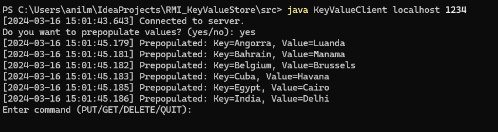
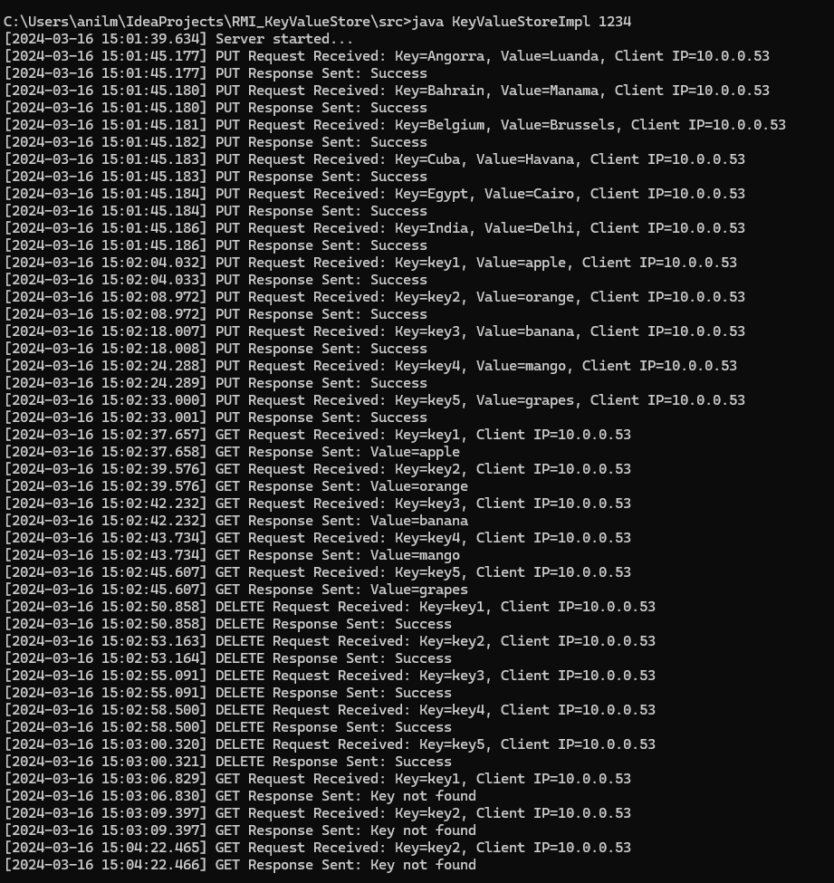
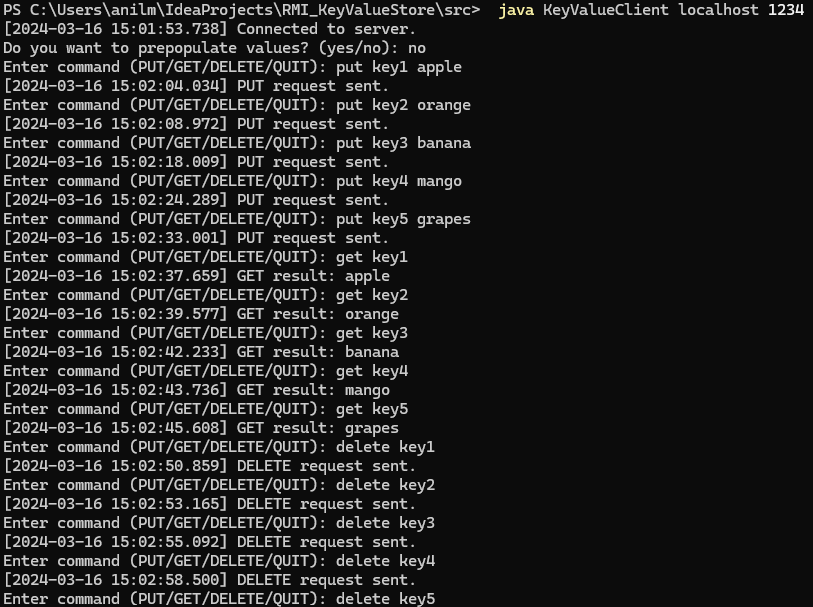

# Key-Value Store with Java RMI

## How to Build
Compile the server and client code:
   ```bash
   javac *.java
   ```

## How to Run

### Server
Start the server with the desired port number (e.g., 1234):

``` bash
java KeyValueStoreImpl 1234
```
The server will start and display logs indicating its status.

### Client
Run the client with the server's IP address and port number:
```bash
java KeyValueClient localhost 1234
```
You can choose to pre-populate values or skip.
Enter ```yes``` if you want the store to be pre-populated with 5 key-value pairs.

Follow the prompts to interact with the key-value store:
Enter commands like PUT, GET, DELETE along with key-value pairs.

```dtd
PUT <key> <Value>
GET <key> <Value>
DELETE <key> <Value>
```

## Executive Summary
### Assignment Overview
The purpose of this project is to implement a key-value store using Java RMI (Remote Method Invocation) for communication between a client and a server. The scope includes developing server and client programs that allow operations like PUT, GET, and DELETE on key-value pairs stored in a HashMap on the server side. The assignment emphasizes understanding RMI communication, handling client-server interactions, implementing basic error handling and logging mechanisms, as well as dealing with concurrency when multiple users access the key-value store simultaneously.

### Technical Impression
I gained hands-on experience with Java RMI, which provided insights into distributed computing paradigms and remote procedure calls. Implementing the server to handle concurrent client requests using multi-threading and ensuring thread safety added depth to my understanding of concurrent programming in Java. Each client request is processed in a separate thread, allowing multiple users to access the key-value store concurrently without blocking other requests. Handling communication protocols, such as PUT, GET, and DELETE, required careful consideration of data serialization and deserialization within a multi-threaded environment. Overall, the assignment enhanced my skills in network programming, error handling, logging practices, and concurrent programming concepts in Java applications. However, I found areas for improvement in refining the user experience, such as providing more detailed error messages and enhancing command-line interface interactions for the client program.

## Screenshots

### Prepopulated Fields

*Screenshot showing prepopulated key-value pairs in the key-value store.*

### Server Logs

*Description: Screenshot of server logs displaying requests received and responses sent.*

### Client Logs

*Description: Screenshot of client logs showing interactions with the key-value store.*


